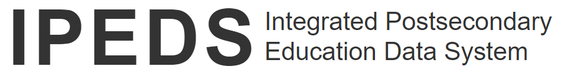
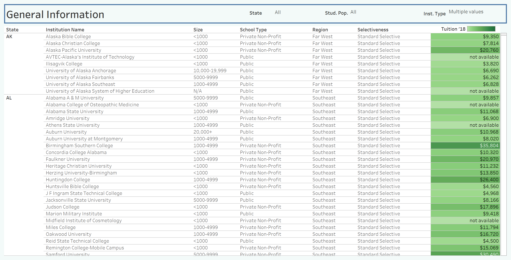
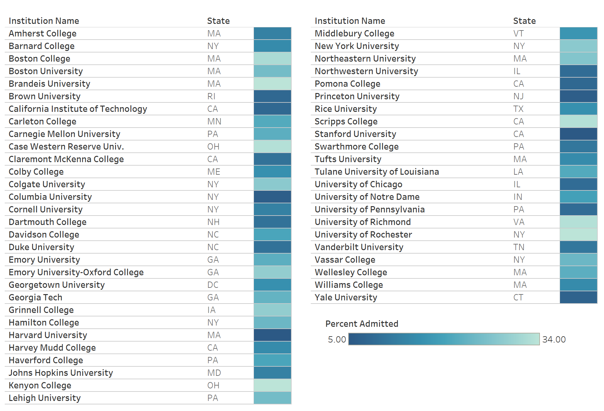
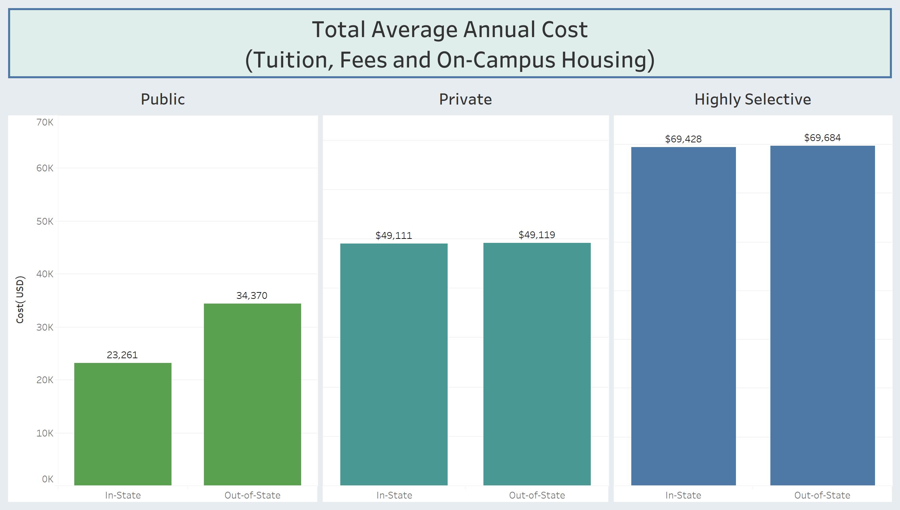
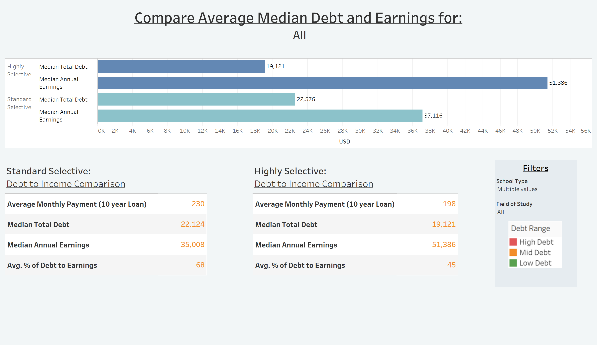

# College Tuition, Debt, and Future Earnings by Field of Study
## Nashville Software School, Data Analytics Capstone Project

## Table of Contents
* [Motivation](#motivation)
* [Data Questions](#the-questions)
* [Data Sources](#data-sources)
* [Methodology](#Approach-and-Analysis)
* [Screenshots](#screenshots-from-project)
* [Conclusions](#main-takeaways)
* [Technologies](#technologies-used)
* [Tableau Link](#tableau-project)

## Motivation
I have a daughter entering her senior year of high school, and as we face one of the biggest decisions of her life, I am interested in helping her choose the best program possible, focus/limit the application process, and maximize our budget for tuition with the best balance of debt and future earnings.
## The Questions
1.	What schools and/or degrees leave students in least debt? 
2.	Compare Public vs Private (not-for-profit) vs “Highly Selective” Schools. Is there a 'best value'?
3.	Is it cost effective to spend money on an elite institution?
## Data Sources
My project uses the Integrated Postsecondary Education Data System (IPEDS) dataset(s) collected by the National Center for Education Statistics (NCES). I also used the College Scorecard "Most Recent Data by Field of Study" to further my exploration of student loan debt and future earning power. 

Links to my data sources:

* College Scorecard Data:
https://collegescorecard.ed.gov/data/

* IPEDS Data:
https://nces.ed.gov/ipeds/use-the-data
https://www.tuitiontracker.org/

* How Highly Selective Schools are Defined:
https://www.collegetransitions.com/college-selectivity/#:~:text=EXTREMELY%20SELECTIVE%20colleges%20accept%20fewer,score%20of%20at%20least%201340

Additional Research (Wall Street Journal):
* http://online.wsj.com/public/resources/documents/info-Salaries_for_Colleges_by_Region-sort.html
* http://online.wsj.com/public/resources/documents/info-Degrees_that_Pay_you_Back-sort.html
* http://online.wsj.com/public/resources/documents/info-Salaries_for_Colleges_by_Type-sort.html

## Approach and Analysis
Some steps I took to manage the extensive datasets were:
* I used the 2017-18 IPEDS data as it had been finalized, while the more recent data was still provisional
* I removed schools from foreign U.S. Territories, as many schools are not accredited and did not pertain to my research
* For the bulk of my findings I did not include private-for-profit schools. They are included in the general search tool but were not used for the debt and earnings analysis.
* Missing values and 'Privacy Suppressed' entries were replaced with null.

## Screenshots from Project
School Search Tool

List of Highly Selective Schools

Cost Comparison

Interactive Debt and Future Earnings Tool

## Main Takeaways

After testing and comparing many diverse fields of study, there were apparent differences in potential earnings depending on the institution. 
* Some fields showed a significant increase in earnings after attending a 'highly selective' school. This was apparent in Engineering fields and Computer Science/IT
* In other fields, such as Journalism and Fine Arts, the difference was less pronounced and would merit additional consideration to determine if the increased initial cost of the degree is warranted
* In some instances, the public and private schools outperformed the elite schools. Dance was a good example of this 

## Technologies Used
* `Access/Excel` - created csv files from Access tables, data cleaning
* `Python, Pandas` - Jupyter notebooks for EDA and merging of data
* `Tableau` - vizualizations and presentation
* `Visual Studio Code` - editing of files
* `GitHub` - version control and storage

## Tableau Project
My final presentation was created on Tableau 2020.1 and is published on Tableau Public which you can see (and try out for yourself) [here](https://public.tableau.com/profile/catherine.schmalzer#!/).